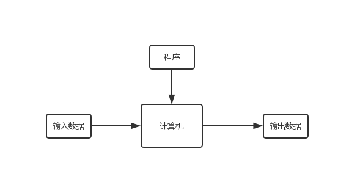
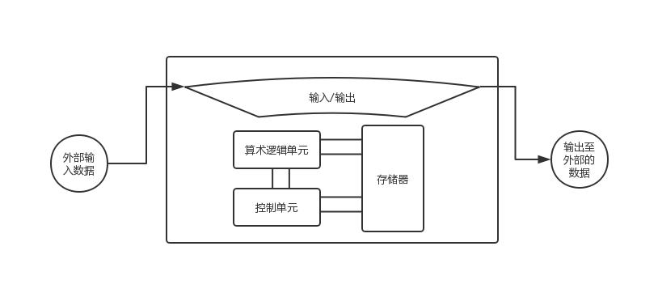

# 第一章 绪论

本章主要讨论如下内容：

+ 计算机模型（图灵，冯诺依曼）
+ 计算机发展史
+ 计算机出现后所增加的社会和道德问题
+ 计算机科学领域总览

## 图灵模型

阿兰·图灵在1937年提出了一个通用计算设备的设想，也就是现在所说的**图灵机**。

### 原始的数据处理器模型

在这个模型的定义下，计算机仅根据外部输入得到输出。

也就是简单的输入->计算机->输出的模型。

但这个定义过于宽泛，其仅仅是描述一类数据处理设备的工作方式，并不能特定规定计算机。

而且其并没有区分其为专用计算模型还是通用计算模型，而显然计算机输入通用计算模型。

### 可编程数据处理器模型

可编程的数据处理器模型则是在上述的数据模型之中加入了**程序**这一额外输入。

改造后的数据处理器模型的工作方式则是输入数据+程序->计算机->输出，这也就是**图灵模型**。

在图灵模型中，计算机根据程序来将输入数据处理成输出数据，这样也就做到了其通用性。

## 冯·诺依曼模型

冯诺依曼模型相较于图灵模型最大的不同点在于，图灵模型只将数据存于计算机中，程序靠外部读取，而冯诺依曼模型将程序和数据都存在计算机中。

基于这个理念设计的冯诺依曼模型如下所示：

其主要包括四个部分：

+ 存储器：用于存储**数据**和**程序**的区域
+ 算术逻辑单元：用于进行计算的单元（包括算术运算和逻辑运算）
+ 控制单元：控制存储器，算术逻辑单元，输入/输出等子系统的单元
+ 输入/输出：包括接收输入的设备，传出输出结果的设备，输入输出缓存区等一系列与输入/输出有关的系统

### 冯诺依曼模型中的程序

在冯诺依曼模型中，程序被看作是一条条指令的集合体。

控制器按顺序从存储器中读入指令，解析指令，执行指令。

## 计算机组成部分

计算机由计算机硬件，数据，计算机软件组成。

## 计算机发展史

+ 机械计算机器（1930年以前）

  这个阶段下出现了许多用于计算的机器，但还没有提出计算机这个概念（简单的讲就是图灵发话以前）。

+ 电子计算机的诞生（1930～1950）

  这个时候开始出现计算机的雏形。早期的电子计算机都是基于图灵模型，换句话说，这个阶段的计算机的程序靠外部输入（打孔卡，人工接线等）。

+ 计算机的诞生（1950～）

  这个阶段开始的计算机基本都是基于冯诺依曼模型的计算机。

  + 第一代计算机（1950～1959）

    这个阶段的计算机体积庞大，且使用真空管作为电子开关。

  + 第二代计算机（1959～1965）

    计算机开始缩小体积，并使用晶体管代替真空管。这个阶段开始出现高级计算机语言。

  + 第三代计算机（1965～1975）

    集成电路替代了晶体管，开始出现小型计算机。与此同时软件包开始出现，人们只需要买过来就能用，而不需要自己写程序。

  + 第四代计算机（1975～1985）

    此时的科技以允许将整个计算机的子系统做在单块电路板上。这个阶段出现了微型计算机和计算机网络。

  + 第五代计算机（1985～）

    这个阶段出现了我们现在所用的掌上计算机和台式计算机。

## 社会和道德问题

社会问题主要有：

+ 依赖：部分人们认为计算机的便利会让人类产生依赖，一旦离开计算机人类的生活就会很困难。
+ 社会公正：部分人们认为只有高端人群才能用得起计算机，这对低端人群不公正。
+ 数字化分裂：基于上一条，用计算机的人群会跟不用计算机的人群产生分裂。

道德问题主要有：

+ 隐私：计算机网络带来的通信和数据隐私问题。
+ 版权：数据版权和电子版权等。
+ 计算机犯罪：黑客之类的。

## 计算机科学领域

计算机科学简单地讲包括两个领域：系统领域和应用领域。

系统领域主要指跟计算机软硬件直接相关的领域，如计算机体系结构，操作系统，计算机网络，算法，程序设计语言，软件工程等。

应用领域主要指与计算机的**使用**有关的领域，如数据库，人工智能等。