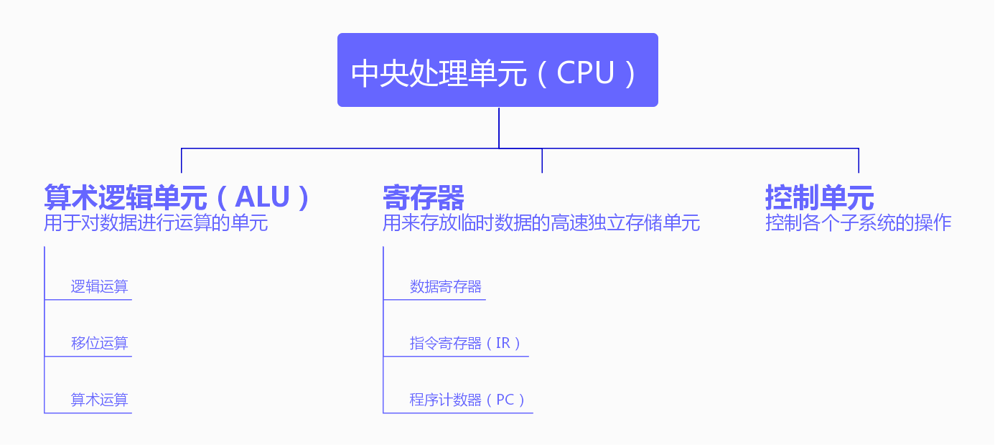

# 第五章 计算机组成

计算机主要由中央处理单元（CPU），主存储器和输入/输出子系统这三大系统组成。

本章主要讨论这三个系统以及其相关的东西。

## 中央处理单元

中央处理单元用于数据运算，程序执行等。

其组成如下图所示：

其中需要特别说明的有：

+ 指令寄存器：用于寄存当前要执行的指令
+ 程序计数器：用于存放一个指向当前执行的指令的数字，当指令执行完成时自动+1

## 主存储器

主存储器是计算机用于存储数据的单元的集合。

在存储器中，数据以称为**字**的位组形式按顺序存放在存储器中。

不同系统下的字长度是不同的，字长可以是8位，16位，32位，甚至64位。

每个字都会有一个编号，编号是按顺序的。这个就是字的地址。

而地址的取值范围就是**地址空间**。举个例子，一个64KB，字长为8位（也就是1字节）的内存一共会有65536个字，那么其地址空间就是`0~65535`。

### 存储器的类型

存储器主要有两种类型：RAM和ROM。

#### RAM

RAM也就是随机存取存储器，是计算机主存储器的主要组成部分。

其可以通过地址随机存取对应的数据内容。（虽然ROM也可以）

RAM的特性主要是**可读写**（用户可以自由读写其中的内容）和**易失性**（一旦断电数据就没了）。

RAM主要分为SRAM（静态RAM）和DRAM（动态RAM）两种。

SRAM使用触发器门电路来存储数据。其速度快且数据始终存在（只要通电），但是价格较贵。

DRAM使用电容器存储数据，当电容充电时为1，放电时为0。其速度较慢且需要定时刷新数据（电容器会随时间漏掉一些电），但是价格便宜。

#### ROM

ROM也就是只读存储器。其相对于RAM而言的特性就是数据只读和不易失性（断电了数据也在）。

ROM常用于存一些开机时执行的程序（例如BIOS）。

其升级版有：

+ PROM：可编程只读存储器。可以借助特殊的设备将数据写在上面，但不能删除数据。
+ EPROM：可擦除可编程只读存储器。在PROM的基础上，可以将其拆下来用特殊设备将其上面的数据擦除。
+ EEPROM：电可擦除可编程只读存储器。在EPROM的基础上，不需要拆除就可以使用电子脉冲擦除数据。

其实这些升级都是为了去掉ROM的只读性质但又想保留其不易失性。

### 存储器的层次结构

简单的讲就是，**越好用的存储器越贵**。

其主要分三级：

+ 寄存器：CPU内的存储器，存取速度最快但最贵
+ 高速缓冲存储器：速度和价格都介于上下两者之间
+ 主存储器：存取速度慢但便宜

所以按照经济的原则，寄存器的大小（也就是使用的数量）是最小的，高速缓存其次，主存是最大的。

于是就不得不说一下高速缓存了。

#### 高速缓冲存储器

这个是在CPU和主存之间的一个存储器，可以理解为一个用于提高速度的高频暂存缓冲区。

当CPU需要从主存中取数据的时候，会先在高速缓存里尝试取数据，如果取不到对应的数据的话就让高速缓存去主存里取对应的数据放到高速缓存中然后再去取。

这样的机制就可以保证在多次存取之后，存取次数较多的数据会在高速缓存中，从而提升宏观的主存存取速度。

## 输入/输出子系统

输入/输出子系统包括非存储设备和存储设备。

### 非存储设备

主要指可以将外部操作作为数据输入到计算机中的输入设备（例如键盘，鼠标等），和可以将数据输出到外部的设备（如显示屏，音响，打印机等）。

### 存储设备

> 9102年了，USB都满天飞了，这本书还是只讲了磁盘和光盘= =

不同于计算机的主存储器，这里泛指可以通过接入计算机将内部数据跟计算机的数据互通的设备。故其仍旧属于输入/输出设备。

这里主要讲两类存储设备：磁介质存储设备和光存储设备。

#### 磁介质存储设备

这类存储设备利用单个点有没有磁性来表示逻辑位0和1，以此来存储数据。

磁介质存储设备有两种：磁盘和磁带

### 光存储设备

这类存储设备利用光反射的原理，在没遇到坑的时候只会反射一次，遇到坑的时候会反射两次，以此来区分0和1。

光存储设备主要有：

+ CD-ROM：只读光盘，坑是事先刻好的
+ CD-R：可刻录光盘，只能刻录一次
+ CD-RW：可重写光盘，可以反复刻录/清除，价格贵于CD-R

## 子系统的互连

首先是CPU和存储器之间的连接。这两者使用总线进行连接。一共分三种总线：

+ 数据总线：用于**以字为单位**传输数据。每根线可以传输1位的数据，故数据总线的线路数就会等于计算机的字长（例如说64位的计算机的数据总线就会有64条）
+ 地址总线：用于传输地址。同样的为了能同时传输n位的数据，需要n根线。而这里的n则取决于地址空间。当地址空间最大为`2^n`时，就需要n根线。
+ 控制总线：用于传输控制命令。当计算机的控制命令一共有`2^m`个的时候就需要m根线。

之后是I/O设备连入计算机的方式。计算机会提供像SCSI，火线，USB，HDMI等控制器用于I/O设备的连接。计算机会将总线分支接入控制器，再由控制器跟外部I/O设备连接。

在这里有一个总线连接的特例，就是控制总线。控制总线会分成CPU跟I/O设备，CPU跟主存两路。当指令不涉及输入/输出的时候，CPU只需要跟主存通信即可；而当指令涉及输入/输出的时候，CPU就需要跟I/O设备通信。

为此有两种方法用来区分开I/O和主存：

+ I/O独立寻址：简单地讲就是，针对I/O设备有专门的指令，而其他指令就只针对主存。举个例子就是，读取数据上，可以设计读取主存数据的命令为`read`，读取输入设备数据的命令为`input`，以此区分两者。
+ I/O存储器映射寻址：简单地讲就是，将I/O设备的寄存器地址映射到主存中，这样就可以靠地址来区分主存和I/O设备了。例如说还是输入这块，命令就只有`read`一个，但根据命令后面接的地址的不同来区分是读取主存还是读取I/O设备。

## 程序执行

程序执行的本质是一系列指令的执行。CPU会一直重复**取指令->译码->执行**这三个动作。

+ 取指令：控制单元命令系统将下一条指令取到CPU的指令寄存器中，被复制的指令的地址会置入程序计数器中（一般不会改变计数器的值），复制成功后程序计数器加一，指向其下一条指令。
+ 译码：控制单元负责将指令寄存器中的指令翻译成一系列二进制可执行代码
+ 执行：根据译码的结果执行相应的操作

### 输入/输出操作

有些操作会涉及到输入/输出，但CPU的速度远快于输入/输出设备。故需要一些方法来同步两者（以输入为例）：

+ 程序控制输入/输出：简单的讲就是**非阻塞操作**。CPU在发出输入请求之后会不断问询输入设备有没有数据，直到有数据为止。
+ 中断控制输入/输出：简单的讲就是**阻塞操作**。CPU在发出输入请求之后会中断，直到输入设备有数据之后再通知CPU接收数据。
+ 直接存储器存取（DMA）：简单的讲就是**加中间件**。新增一个叫DMA，这个相当于专门用于跟输入设备打交道的CPU。当CPU发出输入请求的时候会直接发给DMA而不是输入设备，然后CPU就可以干别的事情了，之后由DMA来做跟输入设备的交互，直到DMA拿到数据了再通知CPU，于是CPU就可以像从存储器里拿数据那样取出输入数据了。

## 不同的体系结构

+ CISC：复杂指令集计算机，也就是用大量的底层指令的计算机，这种设计可以减少程序设计上的负担，但会增加译码的负担。

  + 现在的CISC计算机会加入一个中间过程，将复杂指令转化为多个**微操作**，CPU只执行微操作。于是就需要一个中间结构来做这个过程（也就是**微内存**），使用微操作的程序设计叫做**微程序设计**。

+ RISC：精简指令集计算机，相对于CISC而言，其使用了少量简单的指令。

+ 流水线：流水线的设计目的是改善指令的执行效率。一般而言CPU是一直取指令->译码->执行->取指令。。这样下去的。流水线的思想则是，在第一个指令执行到译码阶段的时候，CPU同时就可以开始做第二个指令的取指令了（因为此时负责取指令的部分是空闲的）。这样的设计可以让CPU三路并行地处理指令。但遇到跳转指令之类的就会需要特殊处理了（舍弃正在译码/取指令的指令）。

+ 并行处理：简单的讲就是通过添置多个控制单元，多个ALU，多个寄存器来做到并行执行指令。

  + 细分下去有如下组织方式：

    | 缩写 |        全称        |
    | :--: | :----------------: |
    | SISD | 单指令流，单数据流 |
    | SIMD | 单指令流，多数据流 |
    | MISD | 多指令流，单数据流 |
    | MIMD | 多指令流，多数据流 |

