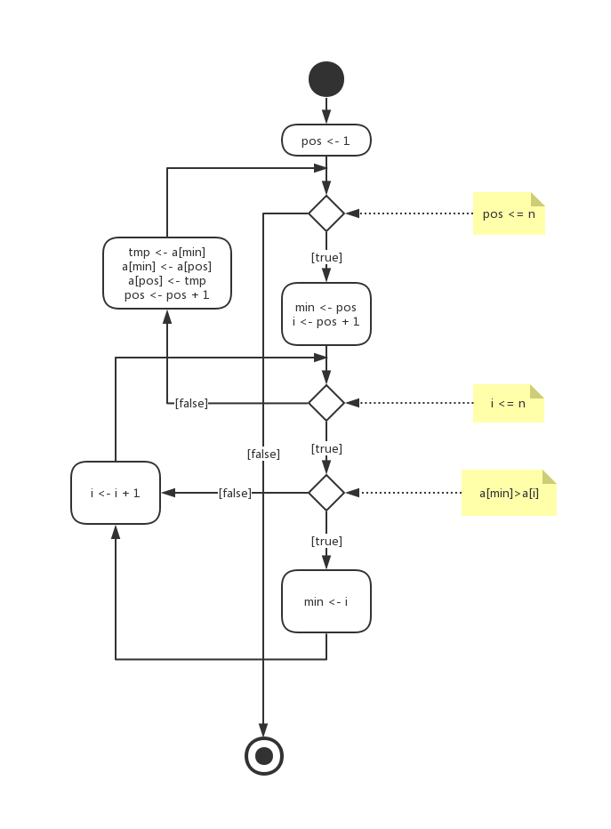
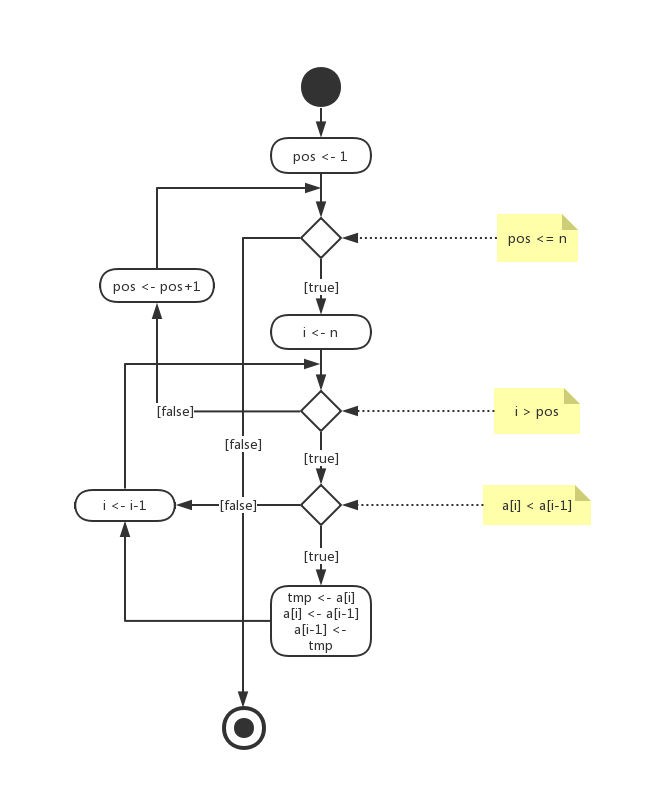
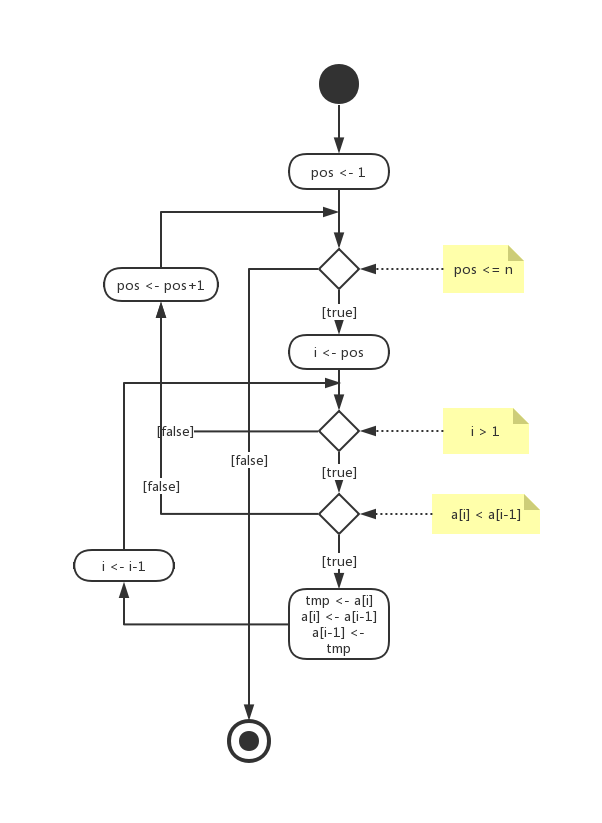
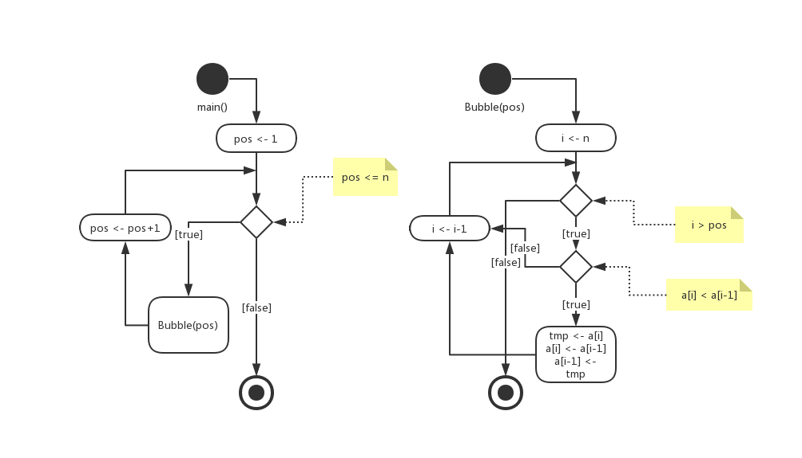
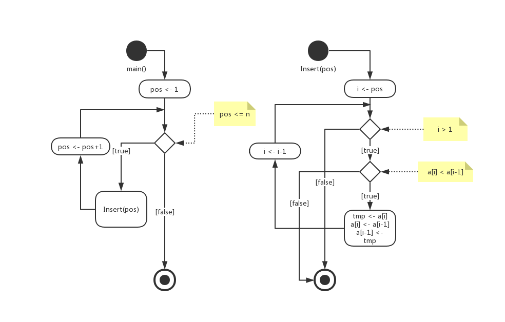
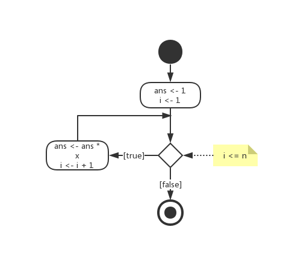

# 第八章练习题

> 卧槽。。39题。。这是要我老命啊

#### 第1题

| 步骤 | 当前数字 | Ans        |
| ---- | -------- | ---------- |
| 初始 | --       | 0          |
| 1    | 20       | 0+20=20    |
| 2    | 12       | 20+12=32   |
| 3    | 70       | 32+70=102  |
| 4    | 81       | 102+81=183 |
| 5    | 45       | 183+45=228 |
| 6    | 1        | 228+1=229  |
| 7    | 3        | 229+3=232  |
| 8    | 81       | 232+81=313 |

#### 第2题

| 步骤 | 当前数字 | Ans               |
| ---- | -------- | ----------------- |
| 初始 | --       | 1                 |
| 1    | 2        | 1*2=2             |
| 2    | 12       | 2*12=24           |
| 3    | 8        | 24*8=192          |
| 4    | 11       | 192*11=2112       |
| 5    | 10       | 2112*10=21120     |
| 6    | 5        | 21120*5=105600    |
| 7    | 20       | 105600*20=2112000 |

#### 第3题

| 步骤 | 当前数字 | Ans  |
| ---- | -------- | ---- |
| 初始 | --       | -∞   |
| 1    | 18       | 18   |
| 2    | 12       | 18   |
| 3    | 8        | 18   |
| 4    | 20       | 20   |
| 5    | 10       | 20   |
| 6    | 32       | 32   |
| 7    | 5        | 32   |

#### 第4题

| 步骤 | 当前数字 | Ans  |
| ---- | -------- | ---- |
| 初始 | --       | ∞    |
| 1    | 18       | 18   |
| 2    | 3        | 3    |
| 3    | 11       | 3    |
| 4    | 8        | 3    |
| 5    | 20       | 3    |
| 6    | 1        | 1    |
| 7    | 2        | 1    |

#### 第5题

| 步骤 | 1    | 2    | 3    | 4    | 5    | 6    | 7    | 8    | 9    |
| ---- | ---- | ---- | ---- | ---- | ---- | ---- | ---- | ---- | ---- |
| 初始 | 14   | 7    | 23   | 31   | 40   | 56   | 78   | 9    | 2    |
| 1    | 2    | 7    | 23   | 31   | 40   | 56   | 78   | 9    | 14   |
| 2    | 2    | 7    | 23   | 31   | 40   | 56   | 78   | 9    | 14   |
| 3    | 2    | 7    | 9    | 31   | 40   | 56   | 78   | 23   | 14   |
| 4    | 2    | 7    | 9    | 14   | 40   | 56   | 78   | 23   | 31   |
| 5    | 2    | 7    | 9    | 14   | 23   | 56   | 78   | 40   | 31   |
| 6    | 2    | 7    | 9    | 14   | 23   | 31   | 78   | 40   | 56   |
| 7    | 2    | 7    | 9    | 14   | 23   | 31   | 40   | 78   | 56   |
| 8    | 2    | 7    | 9    | 14   | 23   | 31   | 40   | 56   | 78   |

#### 第6题

| 步骤 | 1    | 2    | 3    | 4    | 5    | 6    | 7    | 8    | 9    |
| ---- | ---- | ---- | ---- | ---- | ---- | ---- | ---- | ---- | ---- |
| 初始 | 14   | 7    | 23   | 31   | 40   | 56   | 78   | 9    | 2    |
| 1    | 2    | 14   | 7    | 23   | 31   | 40   | 56   | 78   | 9    |
| 2    | 2    | 7    | 14   | 9    | 23   | 31   | 40   | 56   | 78   |
| 3    | 2    | 7    | 9    | 14   | 23   | 31   | 40   | 56   | 78   |
| 4    | 2    | 7    | 9    | 14   | 23   | 31   | 40   | 56   | 78   |
| 5    | 2    | 7    | 9    | 14   | 23   | 31   | 40   | 56   | 78   |
| 6    | 2    | 7    | 9    | 14   | 23   | 31   | 40   | 56   | 78   |
| 7    | 2    | 7    | 9    | 14   | 23   | 31   | 40   | 56   | 78   |
| 8    | 2    | 7    | 9    | 14   | 23   | 31   | 40   | 56   | 78   |

#### 第7题

| 步骤 | 1    | 2    | 3    | 4    | 5    | 6    | 7    | 8    |
| ---- | ---- | ---- | ---- | ---- | ---- | ---- | ---- | ---- |
| 初始 | 7    | 23   | 31   | 40   | 56   | 78   | 9    | 2    |
| 1    | 7    | 23   | 31   | 40   | 56   | 78   | 9    | 2    |
| 2    | 7    | 23   | 31   | 40   | 56   | 78   | 9    | 2    |
| 3    | 7    | 23   | 31   | 40   | 56   | 78   | 9    | 2    |
| 4    | 7    | 23   | 31   | 40   | 56   | 78   | 9    | 2    |
| 5    | 7    | 23   | 31   | 40   | 56   | 78   | 9    | 2    |
| 6    | 7    | 9    | 23   | 31   | 40   | 56   | 78   | 2    |
| 7    | 2    | 7    | 9    | 23   | 31   | 40   | 56   | 78   |

#### 第8题

```
7 8 13 44 26 23 98 57
```

#### 第9题

```
7 8 13 26 44 23 57 98
```

#### 第10题

```
3 7 13 26 44 23 98 57
```

#### 第11题

| 步骤 | first | last | mid  | mid的值 |
| ---- | ----- | ---- | ---- | ------- |
| 初始 | 1     | 8    | 4    | 26      |
| 1    | 5     | 8    | 6    | 56      |
| 2    | 7     | 8    | 7    | 88      |

#### 第12题

| 步骤 | first | last | mid  | mid的值 |
| ---- | ----- | ---- | ---- | ------- |
| 初始 | 1     | 6    | 3    | 44      |
| 1    | 1     | 2    | 1    | 17      |
| 2    | 2     | 2    | 2    | 26      |
| 3    | 2     | 1    | --   | --      |

#### 第13题

| 步骤 | 需要比较的数 | 是否相等 |
| ---- | ------------ | -------- |
| 1    | 4            | 否       |
| 2    | 21           | 否       |
| 3    | 36           | 否       |
| 4    | 14           | 否       |
| 5    | 62           | 否       |
| 6    | 91           | 否       |
| 7    | 8            | 否       |
| 8    | 22           | 否       |
| 9    | 7            | 否       |
| 10   | 81           | 否       |
| 11   | 77           | 否       |
| 12   | 10           | 否       |

#### 第14题

| 步骤 | first | last | mid  | mid的值 |
| ---- | ----- | ---- | ---- | ------- |
| 初始 | 1     | 12   | 6    | 21      |
| 1    | 1     | 5    | 3    | 8       |
| 2    | 4     | 5    | 4    | 10      |
| 3    | 5     | 5    | 5    | 14      |
| 4    | 6     | 5    | --   | --      |

#### 第15题

| 步骤 | F(6)        |
| ---- | ----------- |
| 1    | 6x5x4x3x2x1 |
| 2    | 30x4x3x2x1  |
| 3    | 120x3x2x1   |
| 4    | 360x2x1     |
| 5    | 720x1       |
| 6    | 720         |

#### 第16题

| 步骤 | F(6)           |
| ---- | -------------- |
| 1    | 6xF(5)         |
| 2    | 6x5xF(4)       |
| 3    | 6x5x4xF(3)     |
| 4    | 6x5x4x3xF(2)   |
| 5    | 6x5x4x3x2xF(1) |
| 6    | 6x5x4x3x2x1    |
| 7    | 30x4x3x2x1     |
| 8    | 120x3x2x1      |
| 9    | 360x2x1        |
| 10   | 720x1          |
| 11   | 720            |

#### 第17题

```
算法：gcd(x, y)
目的：求x和y的最大公约数
前提：给定正整数x和y
后续：无
返回：x和y的最大公约数
{
	if (y == 0)		g <- x
	else					g <- gcd(y, x mod y)
	return g
}
```

#### 第18题

```
a: gcd(7, 41) -> gcd(41, 7) -> gcd(7, 6) -> gcd(6, 1) -> gcd(1, 0) -> 1
b: gcd(12, 100) -> gcd(100, 12) -> gcd(12, 4) -> gcd(4, 0) -> 4
c: gcd(80, 4) -> gcd(4, 0) -> 4
d: gcd(17, 29) -> gcd(29, 17) -> gcd(17, 12) -> gcd(12, 5) -> gcd(5, 2) -> gcd(2, 1) -> gcd(1, 0) -> 1
```

#### 第19题

```
算法：C(n, k)
目的：求C(n, k)
前提：给定自然数n和k
后续：无
返回：C(n, k)
{
	if (k == 0 || n == k)				c <- 1
	else if (n > k && k > 0)		c <- C(n-1, k)+C(n-1, k-1)
	else												raise error
	return c
}
```

#### 第20题

```
a:
C(10,3)	-> C(9, 3) + C(9, 2)
				-> C(8, 3) + 2*C(8, 2) + C(8, 1)
				-> C(7, 3) + 3*C(7, 2) + 3*C(7, 1) + C(7, 0)
				-> C(6, 3) + 4*C(6, 2) + 6*C(6, 1) + 3*C(6, 0) + 1
				-> C(5, 3) + 5*C(5, 2) + 10*C(5, 1) + 6*C(5, 0) + 4
				-> C(4, 3) + 6*C(4, 2) + 15*C(4, 1) + 10*C(4, 0) + 10
				-> C(3, 3) + 7*C(3, 2) + 21*C(3, 1) + 15*C(3, 0) + 20
				-> 1 + 7*C(2, 2) + 28*C(2, 1) + 21*C(2, 0) + 35
				-> 8 + 28*C(1, 1) + 28*C(1, 0) + 56
				-> 120

b:
C(5, 5) -> 1

c:
C(2, 7) -> error

d:
C(4, 3)	-> C(3, 3) + C(3, 2)
				-> 1 + C(2, 2) + C(2, 1)
				-> 2 + C(1, 1) + C(1, 0)
				-> 4
```

#### 第21题

```
算法：Fib(n)
目的：求斐波那契数列的第n项
前提：给定自然数n
后续：无
返回：斐波那契数列的第n项
{
	if (n == 0)				f <- 0
	else if (n == 1)	f <- 1
	else if (n > 1)		f <- Fib(n-1) + Fib(n-2)
	else							raise error
	return f
}
```

#### 第22题

```
a:
Fib(2)	-> Fib(1) + Fib(0)
				-> 1 + 0
				-> 1

b:
Fib(3)	-> Fib(2) + Fib(1)
				-> 1 + 1
				-> 2

c:
Fib(4)	-> Fib(3) + Fib(2)
				-> 2 + 1
				-> 3
				
d:
Fib(5)	-> Fib(4) + Fib(3)
				-> 3 + 2
				-> 5
```

#### 第23题



#### 第24题



#### 第25题



#### 第26题



#### 第27题



#### 第28题

```
算法：Sum(a, n)
目的：求和
前提：给定数组a和数组a的元素个数n
后续：无
返回：数组中的数的和
{
	sum <- 0
	i <- 1
	while (i <= n)
	{
		sum <- sum + a[i]
		i <- i + 1
	}
	return sum
}
```

#### 第29题

```
算法：Product(a, n)
目的：求积
前提：给定数组a和数组a的元素个数n
后续：无
返回：数组中的数的积
{
	product <- 1
	i <- 1
	while (i <= n)
	{
		product <- product * a[i]
		i <- i + 1
	}
	return product
```

#### 第30题

```
算法：SelectSort(a, n)
目的：用选择排序排序数组
前提：给定数组a和数组a的元素个数n
后续：无
返回：排序后的数组
{
	pos <- 1
	while (pos <= n)
	{
		min <- pos
		i <- pos + 1
		while(i <= n)
		{
			if (a[min] > a[i])
			{
				min = i
			}
			i <- i + 1
		}
		tmp <- a[min]
		a[min] <- a[pos]
		a[pos] <- tmp
		pos <- pos + 1
	}
	return a
}
```

#### 第31题

```
算法：SelectSort(a, n)
目的：用选择排序排序数组
前提：给定数组a和数组a的元素个数n
后续：无
返回：排序后的数组
{
	pos <- 1
	while (pos <= n)
	{
		min <- Select(a, n, pos)
		tmp <- a[min]
		a[min] <- a[pos]
		a[pos] <- tmp
		pos <- pos + 1
	}
	return a
}

算法：Select(a, n, pos)
目的：选出数组从第pos个元素开始的最小元素
前提：给定数组a和数组a的元素个数n，以及起始位置pos
后续：无
返回：最小的数的坐标
{
  min <- pos
  i <- pos + 1
  while(i <= n)
  {
    if (a[min] > a[i])
    {
      min = i
    }
    i <- i + 1
  }
  return min
}
```

#### 第32题

```
算法：BubbleSort(a, n)
目的：用冒泡排序排序数组
前提：给定数组a和数组a的元素个数n
后续：无
返回：排序后的数组
{
	pos <- 1
	while (pos <= n)
	{
		i <- n
		while (i > pos)
		{
			if (a[i] < a[i-1])
			{
				tmp <- a[i]
				a[i] <- a[i-1]
				a[i-1] <- tmp
			}
			i <- i - 1
		}
		pos <- pos + 1
	}
	return a
}
```

#### 第33题

```
算法：BubbleSort(a, n)
目的：用冒泡排序排序数组
前提：给定数组a和数组a的元素个数n
后续：无
返回：排序后的数组
{
	pos <- 1
	while (pos <= n)
	{
		a <- Bubble(a, n, pos)
		pos <- pos + 1
	}
	return a
}

算法：Bubble(a, n, pos)
目的：冒泡一次数组a从pos开始的子序列
前提：给定数组a和数组a的元素个数n，以及冒泡子序列起始位置pos
后续：无
返回：冒泡后的数组
{
  i <- n
  while (i > pos)
  {
    if (a[i] < a[i-1])
    {
      tmp <- a[i]
      a[i] <- a[i-1]
      a[i-1] <- tmp
    }
    i <- i - 1
  }
	return a
}
```

#### 第34题

```
算法：InsertSort(a, n)
目的：用插入排序排序数组
前提：给定数组a和数组a的元素个数n
后续：无
返回：排序后的数组
{
	pos <- 1
	while (pos <= n)
	{
		i <- pos
		while (i > 1)
		{
			if (a[i] < a[i-1])
			{
				tmp <- a[i]
				a[i] <- a[i-1]
				a[i-1] <- tmp
				i <- i - 1
			}
			else
			{
				break
			}
		}
		pos <- pos + 1
	}
	return a
}
```

#### 第35题

```
算法：InsertSort(a, n)
目的：用插入排序排序数组
前提：给定数组a和数组a的元素个数n
后续：无
返回：排序后的数组
{
	pos <- 1
	while (pos <= n)
	{
		Insert(a, n, pos)
		pos <- pos + 1
	}
	return a
}

算法：Insert(a, n, pos)
目的：将数组中第pos个元素插入在pos前的子序列的位置使该子序列仍旧有序
前提：给定数组a和数组a的元素个数n，以及待插入的数组元素的下标pos
后续：无
返回：插入后的数组
{
  i <- pos
  while (i > 1)
  {
    if (a[i] < a[i-1])
    {
      tmp <- a[i]
      a[i] <- a[i-1]
      a[i-1] <- tmp
      i <- i - 1
    }
    else
    {
      break
    }
  }
	return a
}
```

#### 第36题

```
算法：Search(a, n, elem)
目的：用顺序查找找出元素elem在数组a中的位置
前提：给定数组a和数组a的元素个数n，以及待查找的元素elem
后续：无
返回：元素elem在数组a中第一次出现的位置，如果找不到则返回-1
{
	i <- 1
	ans <- -1
	while (i <= n)
	{
		if (a[i] == elem)
		{
			ans <- i
			break
		}
		i <- i + 1
	}
	return ans
}
```

#### 第37题

```
算法：BinarySearch(a, n, elem)
目的：用折半查找找出元素elem在数组a中的位置
前提：给定排序好的数组a和数组a的元素个数n，以及待查找的元素elem
后续：无
返回：元素elem在数组a中的一个出现的位置，如果找不到则返回-1
{
	ans <- -1
	l <- 1
	r <- n
	while(l <= r)
	{
		mid <- (l + r) / 2
		if (a[mid] == elem)
		{
			ans <- mid
			break
		}
		else if (a[mid] > elem)
		{
			r = mid - 1
		}
		else
		{
			l = mid + 1
		}
	}
	return ans
}
```

#### 第38题



#### 第39题

```
算法：Pow(x, n)
目的：求x的n次幂
前提：给定整数x和自然数n
后续：无
返回：x的n次幂
{
	ans <- 1
	i <- 1
	while (i <= n)
	{
		ans <- ans * x
		i <- i + 1
	}
	return ans
}
```

