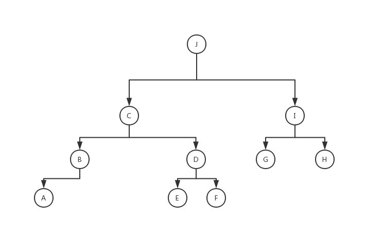
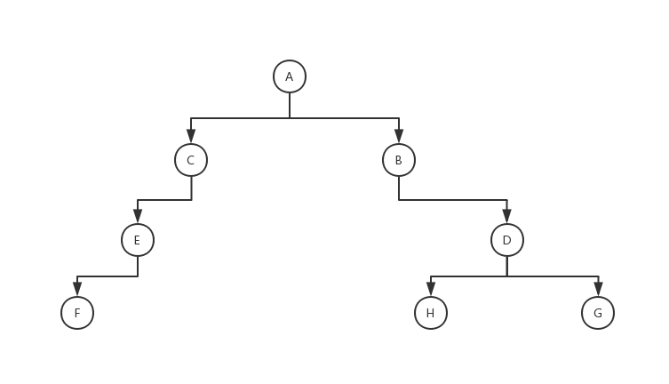

# 第十二章练习题

这里的所有代码都假定已经有了如下的ADT：

```c++
class Stack
{
  void stack();
  int pop();
  void push(int elem);
  bool empty();
};

class Queue
{
  void queue();
  int dequeue();
  void enqueue(int elem);
  bool empty();
};
```

#### 第1题

```c++
void ClearStack(Stack &S2)
{
  while(!S2.empty())
  {
    S2.pop();
  }
}
```

#### 第2题

```c++
void ReverseMoveStack(Stack &S1, Stack &S2)
{
  ClearStack(S2);
  while(!S1.empty())
  {
    int tmp = S1.pop();
    S2.push(tmp);
  }
}

void MoveStack(Stack &S1, Stack &S2)
{
  Stack S;
  S.stack();
  ReverseMoveStack(S1, S);
  ReverseMoveStack(S, S2);
}
```

#### 第3题

```c++
void CopyStack(Stack &S1, Stack &S2)
{
  Stack S;
  S.stack();
  ReverseMoveStack(S1, S);
  ClearStack(S2);
  while(!S.empty())
  {
    int tmp = S.pop();
    S1.push(tmp);
    S2.push(tmp);
  }
}
```

#### 第4题

```c++
void ConnectStack(Stack &S1, Stack &S2)
{
  Stack S;
  S.stack();
  ReverseMoveStack(S2, S);
  while(!S.empty())
  {
    int tmp = S.pop();
    S1.push(tmp);
  }
}
```

#### 第5题

```
S1: 5 6
x: 2
y: 3
```

#### 第6题

```c++
bool CheckPalindrome(string str)
{
  Stack S;
  S.stack();
  for(int i = 0; i < str.length() / 2; i++)
  {
    S.push((int)(str[i]));
  }
  for(int i = (str.length() + 1) / 2; i < str.length(); i++)
  {
    if(S.empty())return false;
    int tmp = S.pop();
    if(tmp != (int)(str[i]))
    {
      return false;
    }
  }
  return true;
}
```

#### 第7题

```c++
bool CheckStackEqual(Stack S1, Stack S2)
{
  while(!(S1.empty() || S2.empty()))
  {
    if(S1.pop() != S2.pop())
    {
      return false;
    }
  }
  if(!(S1.empty() && S2.empty()))
  {
    return false;
  }
  return true;
}
```

#### 第8题

```c++
void ClearQueue(Queue &Q)
{
  while(!Q.empty())
  {
    Q.dequeue();
  }
}
```

#### 第9题

```c++
void MoveQueue(Queue &Q1, Queue &Q2)
{
  ClearQueue(Q2);
  while(!Q1.empty())
  {
    Q2.enqueue(Q1.dequeue());
  }
}
```

#### 第10题

```c++
void CopyQueue(Queue &Q1, Queue &Q2)
{
  Queue Q;
  Q.queue();
  MoveQueue(Q1, Q);
  ClearQueue(Q2);
  while(!Q.empty())
  {
    int tmp = Q.dequeue();
    Q1.enqueue(tmp);
    Q2.enqueue(tmp);
  }
}
```

#### 第11题

```c++
void ConnectQueue(Queue &Q1, Queue &Q2)
{
  while(!Q2.empty())
  {
    Q1.enqueue(Q2.dequeue());
  }
}
```

#### 第12题

```c++
bool CheckQueueEqual(Queue Q1, Queue Q2)
{
  while(!(Q1.empty() || Q2.empty()))
  {
    if(Q1.dequeue() != Q2.dequeue())
    {
      return false;
    }
  }
  if(!(Q1.empty() && Q2.empty()))
  {
    return false;
  }
  return true;
}
```

#### 第13题

```
a: G
b: I
c: E
```

#### 第14题



#### 第15题



#### 第16题

显然不能。

根据后序遍历可知，该树的根为C。

再从中序遍历的结果可知，根节点C的左子树的中序遍历为ABD，右子树的中序遍历为EFG。

这意味着在后序遍历中，ABD是连在一起的（不论其内部顺序），EFG同理。

但显然，在题目中EFG三个节点在后序遍历中不是连在一起的。故无法画出这棵树。

#### 第17题

```c++
class Stack
{
  private:
  
  int body[MAXN];
  int top;
  
  public:
  
  void stack()
  {
    top = 0;
  }
  
  void push(int elem)
  {
    body[top] = elem;
    top++;
  }
  
  int pop()
  {
    top--;
    return body[top];
  }
  
  bool empty()
  {
    return top == 0;
  }
};
```

#### 第18题

```c++
class Stack
{
  private:
  
  struct Node
  {
    int elem;
    Node *nxt;
  };
  
  Node *head;
  
  public:
  
  void stack()
  {
    head = new Node();
    head->elem = 0;
    head->nxt = NULL;
  }
  
  void push(int elem)
  {
    Node *p = new Node();
    p->elem = elem;
    p->nxt = head->nxt;
    head->nxt = p;
    head->elem++;
  }
  
  int pop()
  {
    Node *p = head->nxt;
    int ret = p->elem;
    head->nxt = p->nxt;
    delete p;
    head->elem--;
    return ret;
  }
  
  bool empty()
  {
    return head->elem == 0;
  }
};
```

#### 第19题

```c++
class Queue
{
  private:
  
  int body[MAXN];
  int head, tail;
  
  public:
  
  void queue()
  {
    head = 0;
    tail = 0;
  }
  
  void enqueue(int elem)
  {
    body[tail] = elem;
    tail++;
    tail %= MAXN;
  }
  
  int dequeue()
  {
    int ret = body[head];
    head++;
    head %= MAXN;
    return ret;
  }
  
  bool empty()
  {
    return head == tail;
  }
};
```

#### 第20题

```c++
class Queue
{
  private:
  
  struct Node
  {
    int elem;
    Node *nxt;
  };
  
  Node *head, *tail;
  
  public:
  
  void queue()
  {
    head = new Node();
    head->elem = 0;
    head->nxt=NULL;
    tail = head;
  }
  
  void enqueue(int elem)
  {
    Node *p = new Node();
    p->elem = elem;
    p->nxt = NULL;
    tail->nxt = p;
    tail = p;
    head->elem++;
  }
  
  int dequeue()
  {
    Node *p = head->nxt;
    int ret = p->elem;
    head->nxt = p->nxt;
    delete p;
    head->elem--;
    if(head->elem == 0)
    {
      tail = head;
    }
    return ret;
  }
  
  bool empty()
  {
    return head->elem == 0;
  }
};
```

#### 第21题

```c++
struct Elem
{
  int key;
  int value;
};

class List
{
  private:
  
  Elem body[MAXN];
  int len;
  
  int lower_bound(int elem)
  {
    int l = 0, r = len;
    while(l < r)
    {
      int mid = (l + r) >> 1;
      if(elem <= body[mid].key)
      {
        r = mid;
      }
      else
      {
        l = mid + 1;
      }
    }
    return l;
  }
  
  public:
  
  void list()
  {
    len = 0;
  }
  
  void insert(Elem elem)
  {
    int pos = lower_bound(elem.key);
    for(int i = len - 1; i >= pos; i--)
    {
      body[i + 1] = body[i];
    }
    body[pos] = elem;
    len++;
  }
  
  bool delete(int target, Elem &elem)
  {
    int pos = lower_bound(target);
    if(body[pos].key != target)return false;
    elem = body[pos];
    for(int i = pos; i < len - 1; i++)
    {
      body[i] = body[i + 1];
    }
    len--;
    return true;
  }
  
  bool retrieve(int target, Elem &elem)
  {
    int pos = lower_bound(target);
    if(body[pos].key != target)return false;
    elem = body[pos];
    return true;
  }
  
  void traverse(void (*action)(Elem))
  {
    for(int i = 0; i < len; i++)
    {
      action(body[i]);
    }
  }
};
```

#### 第22题

```c++
struct Elem
{
  int key;
  int value;
};

class List
{
  private:
  
  struct Node
  {
    Elem elem;
    Node *nxt, *pre;
  };
  
  Node *head;
  
  Node* find(int elem)
  {
    Node *p = head->nxt;
    while(p != NULL)
    {
      if((p->elem).key >= elem)
      {
        return p;
      }
      p = p->nxt;
    }
    return p;
  }
  
  public:
  
  void list()
  {
    head = new Node();
    head->nxt = NULL;
    head->pre = NULL;
  }
  
  void insert(Elem elem)
  {
    Node *p = find(elem.key);
    Node *q = new Node();
    q->elem = elem;
    q->nxt = p;
    if(p != NULL)
    {
      q->pre = p->pre;
      p->pre->nxt = q;
      p->pre = q;
    }
    else
    {
      q->pre = head;
      head->nxt = q;
    }
  }
  
  bool delete(int target, Elem &elem)
  {
    Node *p = find(target);
    if(p == NULL || (p->elem).key != target)
    {
      return false;
    }
    elem = p->elem;
    Node *q = p->pre;
    q->nxt = p->nxt;
    p->nxt->pre =q;
    delete p;
    return true;
  }
  
  bool retrieve(int target, Elem &elem)
  {
    Node *p = find(target);
    if(p == NULL || (p->elem).key != target)
    {
      return false;
    }
    elem = p->elem;
    return true;
  }
  
  void traverse(void (*action)(Elem))
  {
    Node *p = head->nxt;
    while(p != NULL)
    {
      action(p->elem);
      p = p->nxt;
    }
  }
};
```

