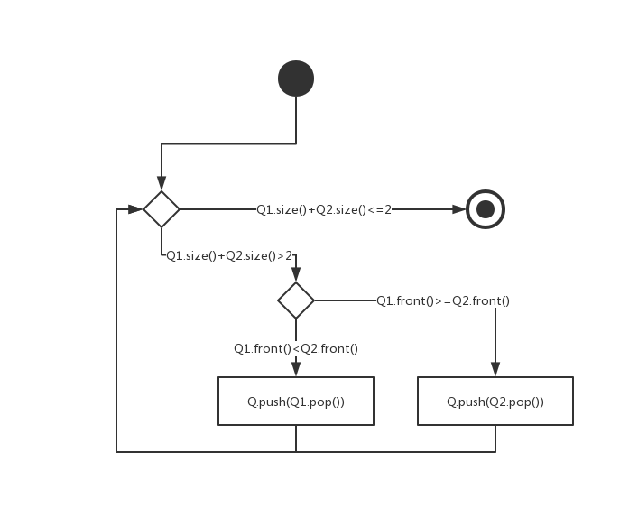
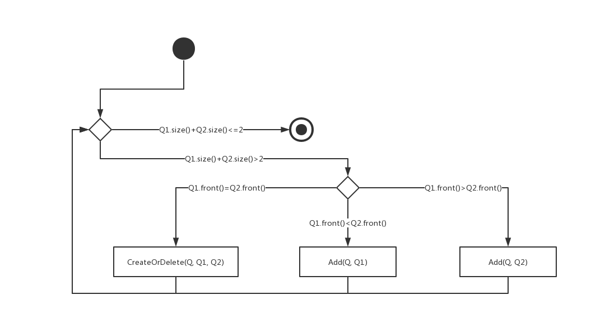
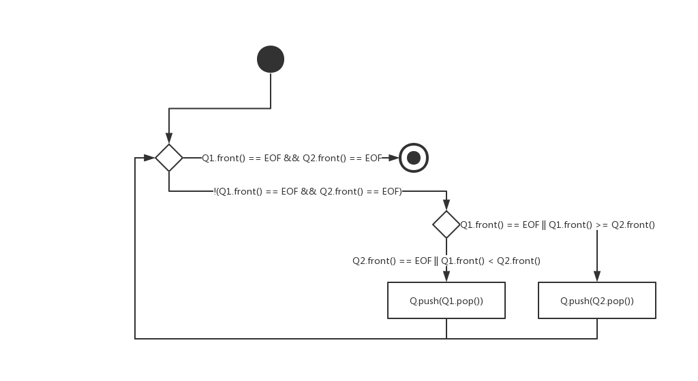
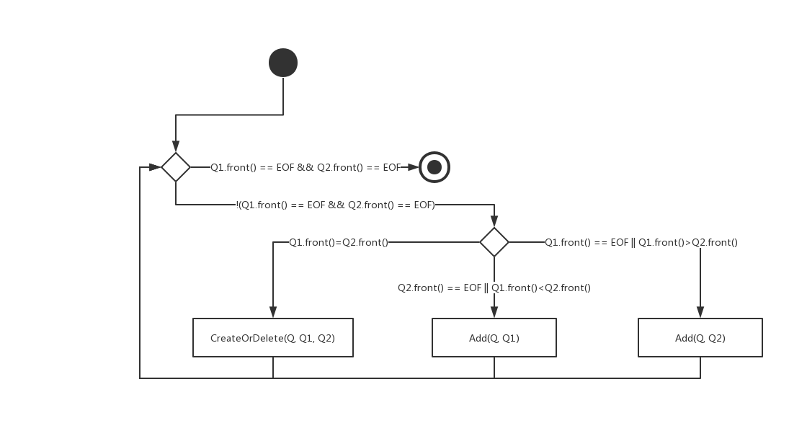

# 第十三章练习题

#### 第1题

新主文件：

| Key  | Name         | Pay rate |
| ---- | ------------ | -------- |
| 14   | John Wu      | 17.00    |
| 16   | George Brown | 18.00    |
| 17   | Duc Lee      | 11.00    |
| 26   | Ted Whit     | 23.00    |
| 31   | Joanne King  | 28.00    |
| 89   | Mark Black   | 19.00    |
| 90   | Orva Gilbert | 20.00    |
| 92   | Betsy Yellow | 14.00    |

错误报告文件：

+ Key 17 Add Error：Key 17 Exist.

#### 第2题

| Key    | Addr |
| ------ | ---- |
| 077654 | 004  |
| 093245 | 003  |
| 114237 | 001  |
| 123453 | 000  |
| 156734 | 002  |
| 256743 | 005  |
| 423458 | 006  |

#### 第3题

a. 6

b. 15

c. 3

d. 8

#### 第4题

a. 16

b. 62

c. 95

d. 40

#### 第5题

a. 36

b. 69

c. 62

d. 47

#### 第6题

a. 106

b. 89

c. 121

d. 114

#### 第7题

a. 4

b. 3

c. 5

d. 406

#### 第8题

a. 4 - 1

b. 3 - 1

c. 4 - 2

d. 406 - 1

#### 第9题



#### 第10题

```c++
// 这里当队列处理，下同
Queue Merge(Queue Q1, Queue Q2)
{
	Queue Q;
	while(Q1.size() + Q2.size() > 2)
	{
		if(Q1.front() < Q2.front())
		{
			Q.push(Q1.pop());
		}
		else
		{
			Q.push(Q2.pop());
		}
	}
	return Q;
}
```

#### 第11题



#### 第12题

```c++
// Q1为事务，Q2为旧文件，Q为新文件
Queue Merge(Queue Q1, Queue Q2)
{
	Queue Q;
	while(Q1.size() + Q2.size() > 2)
	{
		if(Q1.front() < Q2.front())
		{
			Add(Q, Q1);
		}
		else if(Q1.front() == Q2.front())
		{
			CreateOrDelete(Q, Q1, Q2);
		}
    else
    {
      Add(Q, Q2);
    }
	}
	return Q;
}
```

#### 第13题



#### 第14题

```c++
Queue Merge(Queue Q1, Queue Q2)
{
	Queue Q;
	while(!(Q1.front() == EOF && Q2.front() == EOF))
	{
		if(Q1.front() == EOF)
    {
      Q.push(Q2.pop());
    }
    else if(Q2.front() == EOF)
    {
      Q.push(Q1.pop());
    }
		else if(Q1.front() < Q2.front())
		{
			Q.push(Q1.pop());
		}
		else
		{
			Q.push(Q2.pop());
		}
	}
	return Q;
}
```

#### 第15题



#### 第16题

```c++
// Q1为事务，Q2为旧文件，Q为新文件
Queue Merge(Queue Q1, Queue Q2)
{
	Queue Q;
	while(!(Q1.front() == EOF && Q2.front() == EOF))
	{
    if(Q1.front() == EOF)
    {
      Add(Q, Q2);
    }
    else if(Q2.front() == EOF)
    {
      Add(Q, Q1);
    }
		else if(Q1.front() < Q2.front())
		{
			Add(Q, Q1);
		}
		else if(Q1.front() == Q2.front())
		{
			CreateOrDelete(Q, Q1, Q2);
		}
    else
    {
      Add(Q, Q2);
    }
	}
	return Q;
}
```

