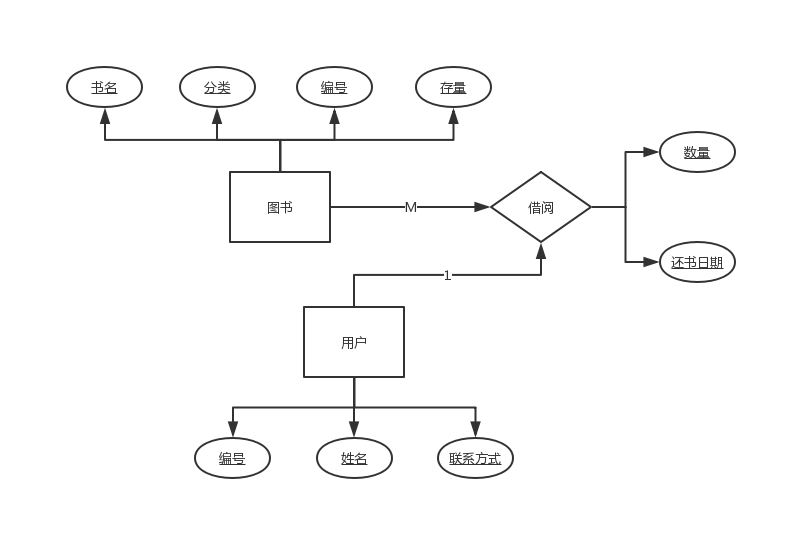
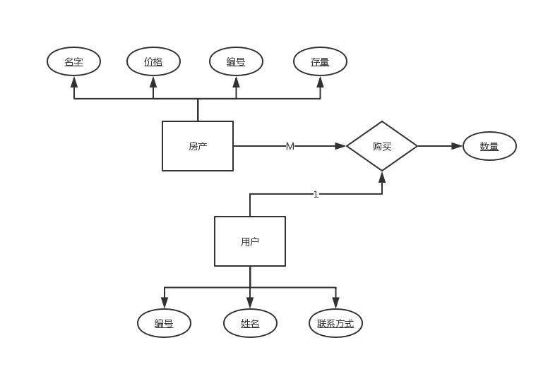
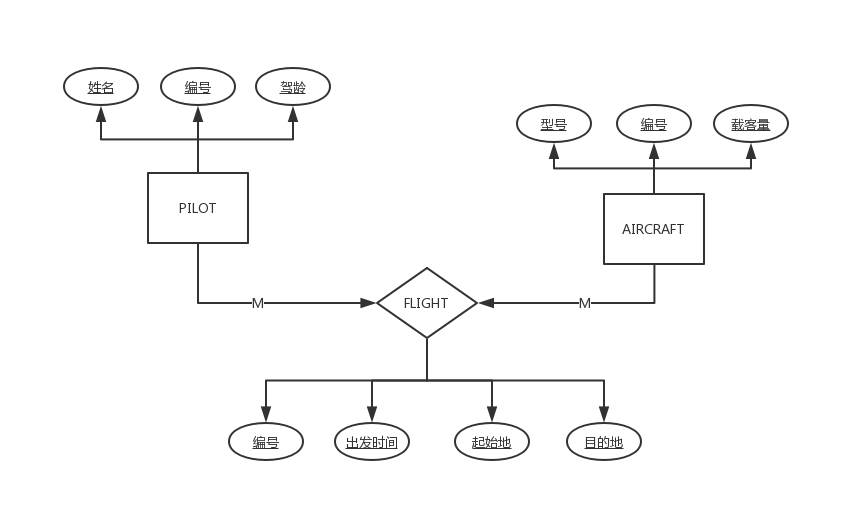

# 第十四章练习题

#### 第1题

| A1   | A2   | A3   |
| ---- | ---- | ---- |
| 2    | 16   | 102  |
| 3    | 16   | 103  |

#### 第2题

| A1   | A2   |
| ---- | ---- |
| 2    | 16   |
| 3    | 16   |

#### 第3题

| A3   |
| ---- |
| 100  |
| 102  |
| 103  |
| 104  |

#### 第4题

| B1   |
| ---- |
| 24   |
| 29   |

#### 第5题

| C1   | C2   | C3   |
| ---- | ---- | ---- |
| 37   | 401  | 1006 |
| 32   | 401  | 1025 |
| 33   | 405  | 1065 |

#### 第6题

```sql
select No, Unit from 课程;
```

#### 第7题

```sql
select ID, Name from 学生;
```

#### 第8题

```sql
select ID, Name from 教授;
```

#### 第9题

```sql
select Name from 系;
```

#### 第10题

```sql
select ID, Courses from 学生 where ID = 2010;
```

#### 第11题

```sql
select Name, Courses from 教授 where Name = "Blake";
```

#### 第12题

```sql
select * from 课程 where Unit = 3;
```

#### 第13题

```sql
select * from 学生 where Courses = "CIS015";
```

#### 第14题

```sql
select No from 系 where Name = "计算机科学系";
```

#### 第15题

显然不是

| A    | B    | C    | D    |
| ---- | ---- | ---- | ---- |
| 1    | 70   | 65   | 14   |
| 2    | 25   | 24   | 12   |
| 2    | 25   | 24   | 18   |
| 2    | 32   | 24   | 12   |
| 2    | 32   | 24   | 18   |
| 2    | 71   | 24   | 12   |
| 2    | 71   | 24   | 18   |
| 3    | 32   | 6    | 18   |
| 3    | 32   | 11   | 18   |

#### 第16题



#### 第17题



#### 第18题



#### 第19题

第三范式：在2NF的基础上，非主键之间相互独立，不能产生函数依赖。简单地讲就是不能留有传递函数依赖

#### 第20题

BC范式：在3NF的基础上，主属性内不能存在函数依赖

