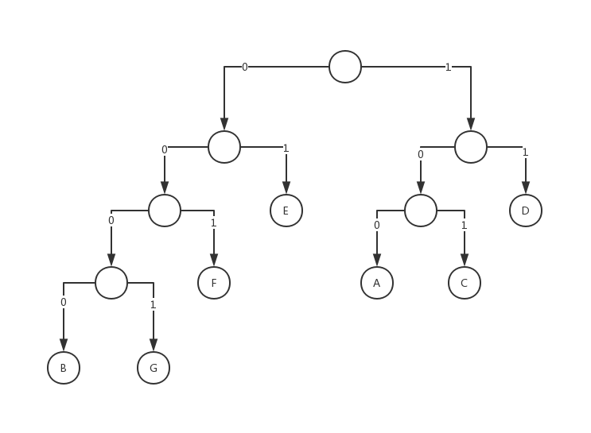
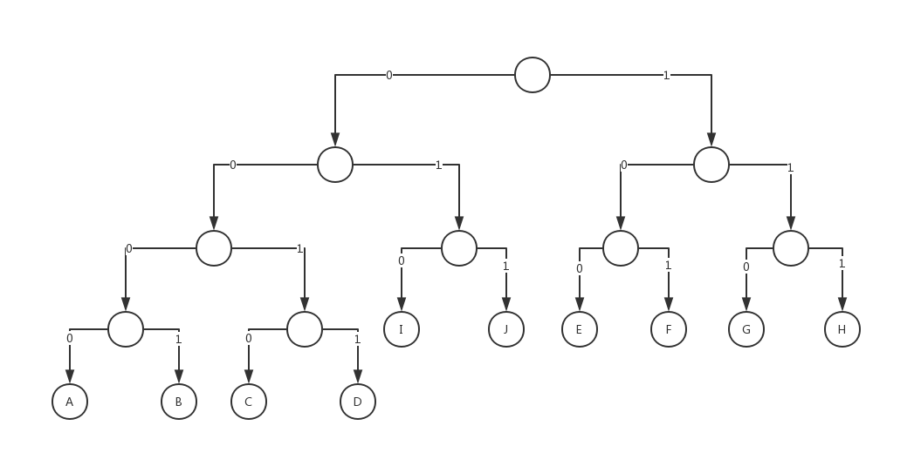

# 第十五章练习题

#### 第1题

```
10010 00000 11111 11001 01111 00000 00000
```

#### 第2题

```
00000 01000 11111 01110 00000 00000
```

#### 第3题

赫夫曼树如下：



故各个字符编码如下：

```
A: 100
B: 0000
C: 101
D: 11
E: 01
F: 001
G: 0001
```

#### 第4题

赫夫曼树如下：



故各个字符编码如下：

```
A: 0000
B: 0001
C: 0010
D: 0011
E: 100
F: 101
G: 110
H: 111
I: 010
J: 011
```

#### 第5题

是，其可以构成赫夫曼树

#### 第6题

不是，A的编码为C的编码的前缀，这显然不符合赫夫曼编码的性质

#### 第7题

```
100010101010001100
```

#### 第8题

```
ABBAAACCA
```

#### 第9题

+ 读入`B`，编码为`B`

| 1    |
| ---- |
| B    |

+ 读入`A`，编码为`A`

| 1    | 2    |
| ---- | ---- |
| B    | A    |

+ 读入`AB`，编码为`2B`

| 1    | 2    | 3    |
| ---- | ---- | ---- |
| B    | A    | AB   |

+ 读入`BB`，编码为`1B`

| 1    | 2    | 3    | 4    |
| ---- | ---- | ---- | ---- |
| B    | A    | AB   | BB   |

+ 读入`BA`，编码为`1A`

| 1    | 2    | 3    | 4    | 5    |
| ---- | ---- | ---- | ---- | ---- |
| B    | A    | AB   | BB   | BA   |

+ 读入`AC`，编码为`2C`

| 1    | 2    | 3    | 4    | 5    | 6    |
| ---- | ---- | ---- | ---- | ---- | ---- |
| B    | A    | AB   | BB   | BA   | AC   |

+ 读入`AA`，编码为`2A`

| 1    | 2    | 3    | 4    | 5    | 6    | 7    |
| ---- | ---- | ---- | ---- | ---- | ---- | ---- |
| B    | A    | AB   | BB   | BA   | AC   | AA   |

综上，最终编码为`B,A,2B,1B,1A,2C,2A`

#### 第10题

+ 读入`A`，编码为`A`

| 1    | 2    |
| ---- | ---- |
| ABB  | A    |

+ 读入`AA`，编码为`2A`

| 1    | 2    | 3    |
| ---- | ---- | ---- |
| ABB  | A    | AA   |

+ 读入`ABBC`，编码为`1C`

| 1    | 2    | 3    | 4    |
| ---- | ---- | ---- | ---- |
| ABB  | A    | AA   | ABBC |

+ 读入`C`，编码为`C`

| 1    | 2    | 3    | 4    | 5    |
| ---- | ---- | ---- | ---- | ---- |
| ABB  | A    | AA   | ABBC | C    |

+ 读入`CB`，编码为`5B`

| 1    | 2    | 3    | 4    | 5    | 6    |
| ---- | ---- | ---- | ---- | ---- | ---- |
| ABB  | A    | AA   | ABBC | C    | CB   |

+ 读入`B`，编码为`B`

| 1    | 2    | 3    | 4    | 5    | 6    | 7    |
| ---- | ---- | ---- | ---- | ---- | ---- | ---- |
| ABB  | A    | AA   | ABBC | C    | CB   | B    |

+ 读入`B`，编码为`7`

综上，最终编码为`A,2A,1C,C,5B,B,7`

#### 第11题

```
T(0, 0)	= (1 / 16)[P(0, 0) + P(0, 1) + P(1, 0) + P(1, 1)]
				= (1 / 16)[64 + 32 + 128 + 148]
				= (1 / 16) * 372
				= 23.25
T(0, 1)	= (1 / 16)[0.95P(0, 0) + 0.90P(0, 1) + 0.85P(1, 0) + 0.80P(1, 1)]
				= (1 / 16)[60.8 + 28.8 + 108.8 + 118.4]
				= (1 / 16) * 316.8
				= 19.8
T(1, 0)	= (1 / 16)[0.90P(0, 0) + 0.85P(0, 1) + 0.80P(1, 0) + 0.75P(1, 1)]
				= (1 / 16)[57.6 + 27.2 + 102.4 + 111]
				= (1 / 16) * 298.2
				= 18.6375
T(1, 1)	= (1 / 16)[0.85P(0, 0) + 0.80P(0, 1) + 0.75P(1, 0) + 0.70P(1, 1)]
				= (1 / 16)[54.4 + 25.6 + 96 + 103.6]
				= (1 / 16) * 279.6
				= 17.475
```

