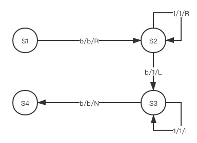
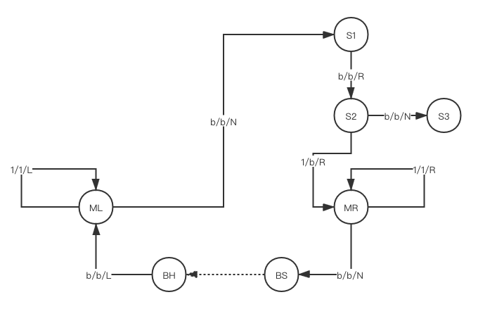

# 第十七章 计算理论

本章主要介绍计算理论的入门知识

## 简单语言

简单语言仅包括三条语句：

```
incr(X)			// X递增1
decr(X)			// X递减1
while(X){}	// 当X不为0时循环
```

通过这些简单语言的组合可以实现任何语言能实现的程序（除开效率因素）

## 图灵机

图灵机由三部分组成：磁带（存储设备），读/写头（I/O设备），控制器（控制单元）。

### 磁带

磁带可以看做是一个无限长的数组，数组的元素只有1和空两种。

磁带中存储数字是按1的个数来存的，例如说数字4就是1个空再跟4个1再跟1个空。

### 读/写头

读/写头指向磁带的某个元素，其可以读写指向的元素的值（赋1、清空）

### 控制器

控制器控制读写头的读写和移动（左移、右移）

控制器的控制逻辑可以使用**有限状态自动机**来表，其中状态转移路径分三种：

+ x/y/R：如果读了x，就写y并右移
+ x/y/L：如果读了x，就写y并左移
+ x/y/N：如果读了x，就写y并不动

### 图灵机对简单语言的模拟

图灵机只需要根据简单语言的逻辑构建自动机即可。

#### 递增

该语句的目标是，让读写头指向的数字加一，换句话说就是**添加一个1**

于是其核心逻辑就是：

+ 移到数字末尾，也就是空的位置
+ 将空写为1
+ 移回一开始的空位。

其自动机如图所示（其中S4表示停机）：



#### 递减

该语句的目标是，让读写头指向的数字减一，换句话说就是**减少一个1**

于是核心逻辑就是：右移一格并置为0

其自动机如图所示（其中S3表示停机）：


#### 循环语句

这里实现的循环语句是这样的：

```
while(X)
{
	decr(X)
	B
}
```

其中B是另一个程序，在状态机中用BS表示程序开头，BH表示程序结束。

该程序运行需要包括两个数据：

+ 数字X
+ 程序B要处理的数据

这里数字X与程序B要处理的数据仅用一个空隔开，并且数字X在左。

于是控制器需要做的事情就是：

+ 右移一位看看X是否没有1了，没有的话就结束运行
+ 有的话将这个1抹掉，并右移到程序B要处理的数据的开始位。执行程序B
+ 执行程序B结束之后再移回X开始的空位，然后回到第一步

其自动机如图所示（其中S3表示停机）：



### 邱奇 - 图灵论题

如果存在一个能完成一个符号操纵任务的算法，那么也存在一台完成这个任务的图灵机。

## 歌德尔数

简单地将就是，将语言的所有符号进行编号，就可以将程序转换为一个数字，这便是歌德尔数。

## 停机问题

停机问题指的是，是否存在一个程序可以判断某个程序在特定输入下会不会停机。

当程序存在无限循环之类的过程时便是一个不会停机的程序。

可惜的是**停机问题不可能解决**

### 反证法论证

首先将停机问题具体化：假设停机问题成立，那么必将存在一个程序Test用于验证一个程序是否停机。

Test将程序P转化为歌德尔数，再加上程序P的输入参数S作为输入，如果该程序会停机则输出1，否则输出0。

于是就有：

```
Test(P, S)	-> 1 如果程序P在输入为S的情况下停机
						-> 0 如果程序P在输入为S的情况下不停机
```

现在假定程序Hack为：

```
Hack(P)
{
	while(Test(P, P))
	{}
}
```

Hack程序的意思是，如果程序P用自身作为输入时停机，则Hack不会停机，否则Hack停机。

现在运行以下程序：

```
Test(Hack, Hack)
```

那么就有两种情况：

+ Test(Hack, Hack)返回True，这意味着Hack(Hack)会停机，但事实上Hack(Hack)会执行到while这一步然后因为Test(Hack, Hack)而死循环，使Hack(Hack)不停机。
+ Test(Hack, Hack)返回False，这意味着Hack(Hack)不会停机，但事实上Hack(Hack)会执行到while这一步然后因为Test(Hack, Hack)而跳过循环直接返回，使Hack(Hack)停机。

故其成为悖论，于是可以得到Test程序不可能存在。

## 问题复杂度

其实就是解决问题所需的时间复杂度

问题分为不可解问题（例如停机问题）和可解问题（例如x+y）

可解问题由分为多项式问题和非多项式问题。

多项式问题指的是时间复杂度为多项式的，例如O(logn)，O(n^2)，O(1)等

非多项式问题指的是时间复杂度为非多项式的，例如O(10^n)，O(n!)等